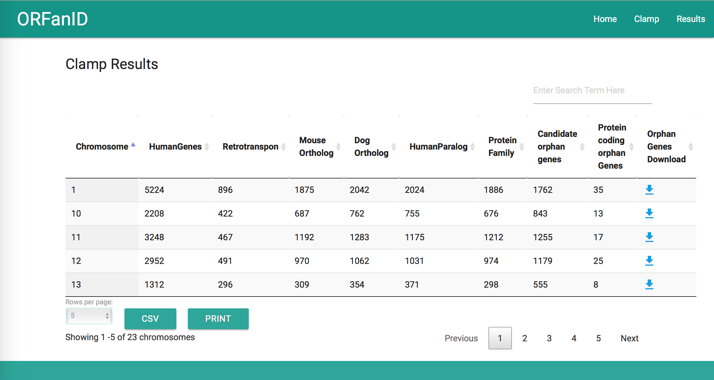

# ClampPipeline
Finding Orphan Genes from Ensembl Annoations with BioMart R Library

## Comparative Genomic Studies of ORFan genes in Mammalian Genomes

### Purpose

Investigate the function/s, if any, of the ORFan gene sequences identified in previous studies from the literature, with a special focus of Clamp at el study. However, the initial goal is to find out all the orphan genes of the human genome.

### Methods

Human Genome GRCh38.p7 was used for the analysis.

A bioinformatics pipeline was developed using R language with BiomaRt package to filter genes. BiomaRt is the official filtering tool to query ensemble databases. There were six main steps in the filtering process:

1. Removal of Retrotransposons/Pseudogenes
2. Removal of orthologous genes with Dog
3. Removal of orthologous genes with Mouse
4. Removal of paralogous genes within Human
5. Removal of known pfam genes
6. Removal of genes that absent the protein sequence (i.e. non-coding genes)
